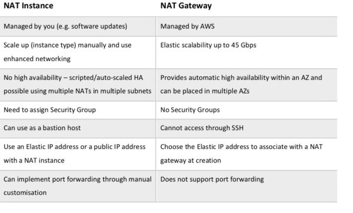
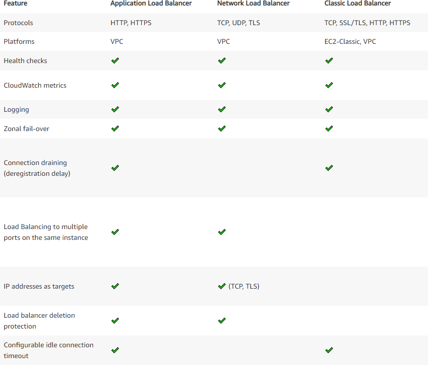
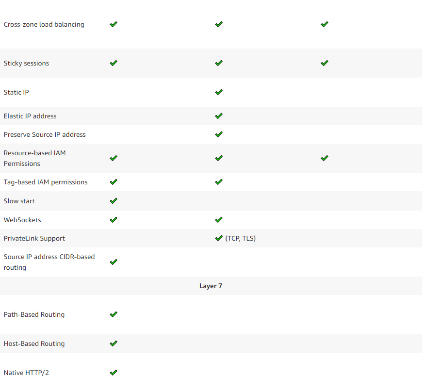
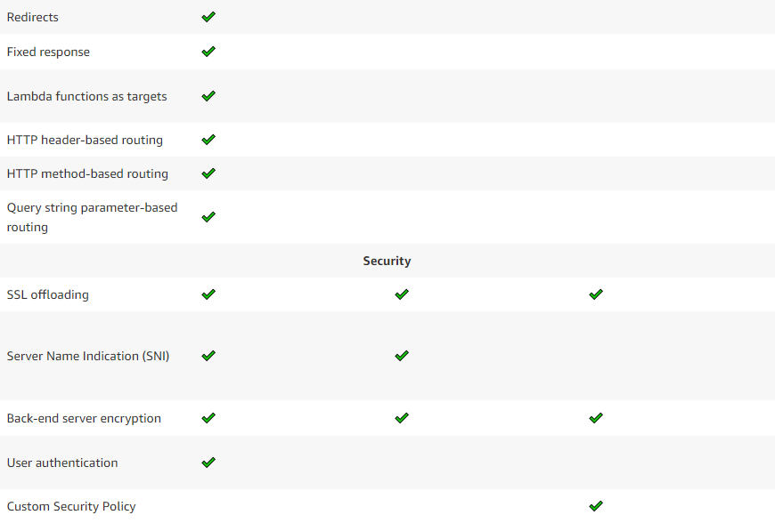
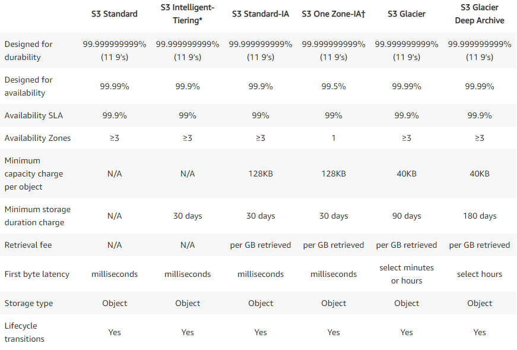

# Overview of Amazon Web Services

Amazon Web Services offers a broad set of global cloud-based products
including compute, storage, databases, analytics, networking, mobile,
developer tools, management tools, IoT, security, and enterprise applications:
on-demand, available in seconds, with pay-as-you-go pricing

## What is Cloud Computing

Cloud computing provides a simple way to access servers, storage, databases
and a broad set of application services over the Internet. A cloud services
platform, such as Amazon Web Services, owns and maintains the network
connected hardware required for these application services, while you provision
and use what you need via a web application.

## Six Advantage of Cloud Computing

1. Trade capital expense for variable expense
1. Benefit from massive economies of scale
1. Stop guessing capacity
1. Increase speed and agility
1. Stop spending money running and maintaining data centers
1. Go global in minutes

## Types of Cloud Computing

Understanding the differences between Infrastructure as a Service, Platform as
a Service, and Software as a Service, as well as what deployment strategies
you can use, can help you decide what set of services is right for your needs.

### Cloud Computing Models

Infrastructure as a Service (IaaS)

> Think EC2.
>
> Infrastructure as a service (IaaS) is an instant computing infrastructure,
> provisioned and managed over the internet

Platform as a Service (IaaS)

> Think Elastic Beanstalk or Lightsail.  
>
> Platform as a service (PaaS) is a complete development and deployment
> environment in the cloud, with resources that enable you to deliver
> everything from simple cloud-based apps to sophisticated, cloud-enabled
> enterprise applications.

Software as a Service (SaaS)

> Think Gmail.  
>
> Software as a service (SaaS) allows users to connect to and use
> cloud-based apps over the Internet.

### Cloud Computing Deployment Models

Cloud

> A cloud-based application is fully deployed in the cloud and all parts of
> the application run in the cloud.

Hybrid

> A hybrid deployment is a way to connect infrastructure and applications
> between cloud-based resources and existing resources that are not located
> in the cloud.

On-Premises

> The deployment of resources on-premises, using virtualization and resource
> management tools, is sometimes called the “private cloud.”

## Global Infrastructure

The AWS Cloud infrastructure is built around AWS Regions and Availability
Zones.

AWS Region

> A physical location in the world with multiple (at least two) Availability > Zones.

AWS Availability Zone

> One or more discrete data centers, each with redundant power, networking,
> and connectivity housed in separate facilities

## Security and Compliance

### Security

The AWS Cloud enables a shared responsibility model.

Below are examples of controls that are managed by AWS, AWS Customers and/or both.

Inherited Controls

> Controls which a customer fully inherits from AWS.
>
> - Physical and Environmental controls

Shared Controls

> Controls which apply to both the infrastructure layer and customer layers.
>
> - Patch Management
> - Configuration Management
> - Awareness & Training

Customer Specific

> Controls which are solely the responsibility of the customer
>
> - Service and Communications Protection or Zone Security

#### Penetration Testing

AWS customers are welcome to carry out security assessments or penetration
tests against their AWS infrastructure without prior approval for 8 services,
listed below:

- EC2 Instances, NAT Gateways, and Elastic Load Balancers
- RDS
- CloudFront
- Aurora
- API Gateways
- Lambda and Lambda Edge functions
- Lightsail resources
- Elastic Beanstalk environments

#### Security Resources

- [Shared Responsibility Model](https://aws.amazon.com/compliance/shared-responsibility-model/)

### Compliance

AWS Cloud Compliance enables you to understand the robust controls in place
at AWS to maintain security and data protection in the cloud.

AWS Artifact is the central resource for compliance-related information. It
provides on-demand access to security and compliance reports and select online
agreements. Reports available in AWS Artifact include our Service Organization
Control (SOC) reports, Payment Card Industry (PCI) reports, and certifications
from accreditation bodies across geographies and compliance verticals that
validate the implementation and operating effectiveness of AWS security
controls.

## Amazon Web Services Cloud Platform

There are three ways to access AWS services -

1. Management Console
1. Command Line Interface (CLI)
1. Software Development Kits (SDKs)

### Analytics

Athena

> Run SQL queries against data stored in S3 without the need for complex
> extract, transform, and load (ETL) jobs to prepare the data for analysis.

Elastic Map Reduce (EMR)

> A big data platform for processing vast amounts of data in the cloud using
> popular open source tools.

CloudSearch

> A fully managed service for adding simple and cost effective search
> solutions to websites or applications.

Elasticsearch Service

> A service to deploy, operate and manage Elasticsearch to provide search,
> analyses, and visualization of data in real-time.

Kinesis

> A service for collecting, processing, and analyzing real-time, streaming data.

Redshift

> A fast, scalable data warehouse for analyzing data.

QuickSight

> A business intelligence (BI) service.

Data Pipeline

> A web service for moving data between different cloud sources and
> on-premise sources at specified intervals.

Glue

> A fully managed extract, load, and transform (ETL) service to prepare and
> load data for analytics.

Lake Formation

> A service to help with setting up a secure data lake.

### Application Integration

Step Functions

> Allows multiple services to be combined into serverless workflows.

Simple Queue Service (SQS)

> A fully managed message queuing service.
>
> SQS offers two types of message queues:
>
> 1. Standard queues
> 1. First In First Out (FIFO) queues

Simple Notification Service (SNS)

> A Fully managed pu/sub messaging service.

Simple Workflow (SWF)

> A service to help build, run, and scale background jobs that have sequential
> or parallel steps.

### Cost Management

Cost Explorer

> Used to visualize, understand, and manage costs and usage over time.  This
> is accomplished with the following:
>
> - Monthly costs by AWS service
>   - Includes a default report that helps you visualize the costs and usage
>   associated with your top five cost-accruing AWS services
>   - Gives you a detailed breakdown on all services in the table view
> - Hourly and resource level granularity
>   - Helps you visualize, understand, and manage your AWS costs and usage
>   over a daily or monthly granularity
>   - Lets you dive deeper using granular filtering and grouping dimensions
>   such as Usage Type and Tags
>   - Can also access your data with further granularity by enabling hourly\
>   and resource level granularity
>
> Provides Reserved Instance (RI) purchase recommendations based on past usage
> to indicate potential saving opportunities over On-Demand instances.

Budgets

> Used for the following:
>
> - Set custom budgets that alert you when your costs or usage exceed or are
forecasted to exceed your budgeted amount.
> - Set Reserved Instance (RI) utilization targets that alert when
> utilization drops below the defined threshold.
> - View current estimated charges and charges from predicted usage.
>
> Types of budgets:
>
> - Cost budgets
> - Usage budgets
> - RI utilization budgets
> - RI coverage budgets

Cost & Usage Report

> - Contains the most comprehensive set of cost and usage data available
> - Contains line items for each unique combination of AWS products, usage
> type, and operation
> - Receive reports that break down costs:
>   - By the hour or month
>   - By product or product resource
>   - By cost allocation tags that you define yourself
> - Deliver billing report files to S3 buckets in CSV format
>   - Can be loaded into Athena, Redshift, Quicksight, etc. for analysis
> - Can track your Reserved Instance utilization, charges, and allocations

### Compute

Elastic Cloud Compute (EC2)

Think virtual machines in the cloud.

A service that provides secure, resizable computer capacity in the cloud.

#### Instance Types

- On-Demand
  > Pay for compute capacity by the hour with no long-term commitments
- Reserved Instances
  > Offer significant cost saving over On-Demand for a 1 or 3 year commitment
  >
  > Choose between three payment options:
  >
  > 1. All Upfront
  > 1. Partial Upfront
  > 1. No Upfront
  >
  > Reserved Instance Types:
  >
  > - Convertible
  >   - Capability to change the attributes of the RI as long as the exchange
  >     results in the creation of RIs of equal or greater value.
  >   - Change Availability Zone, instance size (for Linux OS), networking type
  >   - Change instance families, operating system, tenancy, and payment option
  > - Scheduled
  >   - Are available to launch within the reserved time windows.
  >   - Allows matching capacity reservation to a predictable recurring
  >     schedule that only requires a fraction of a day, a week, or a month.
  >
- Spot
  > Allow for bidding on spare or unused EC2 compute capacity for a
  > significant discount.
- Dedicated Host
  > A physical server with EC2 instance capacity fully dedicated to a single
  > customer's use.
  >
  > Supports use of existing per-socket, per-core, or per-VM software licenses.

EC2 Auto Scaling

> Maintains application availability by automatically adding or removing EC2
> instances according to defined conditions.
>
> Types of scaling:
>
> - Scheduled
>   - Scale applications ahead of known load changes
> - Dynamic
>   - Scale applications based on a particular metric
> - Predictive
>   - Scale applications using machine learning traffic predictions

Elastic Container Registry (ECR)

> A fully managed Docker container registry.

Elastic Container Service (ECS)

> A container orchestration service that supports docker containers.

Elastic Container Service for Kubernetes (EKS)

> A service to deploy, manage, and scale containerized applications on AWS
> using Kubernetes.

Lightsail

> An easy way to launch and manage a virtual private server, includes a
> virtual machine, SSD storage, data transfer, DNS management, and a static IP
> address.

Batch

> Enables developers, scientists, and engineers to easily and efficiently run
> hundreds of thousands of batch computing jobs.

Elastic Beanstalk

> A service for deploying and scaling web applications and services developed
> with Java, .NET, PHP, Node.js, Python, Ruby, Go, and Docker on familiar
> servers such as Apache, Nginx, Passenger, and IIS.  
>
> Leverages the automation capabilities of CloudFormation to build out
> application architectures.

Quick Starts

> Quick Starts are built by AWS solutions architects and partners to help you
> deploy popular technologies on AWS, based on AWS best practices for security
> and high availability.

Lambda

> Serverless functions.

### Customer Engagement

Connect

> A self-service, cloud-based contact center service.

Simple Email Service (SES)

> An email sending service designed to with marketing, transactional, or
> notification emails.

### Database

Aurora

> A fast, scalable MySQL and PostgreSQL compatible relational database engine
> that features a distributed, fault-tolerant, self-healing storage system.

Relational Database Service (RDS)

> A service for setting up, operating, and scaling relational database
> services in the cloud.
>
> By default, RDS created and saves automated backups of DB instances securely
> in S3 for a specified retention period.
>
> With Point-in-time restores, a DB instance can be restored to any specific
> time during the backup retention period, creating a new DB instance.

DynamoDB

> A NoSQL database that supports key-value and document data models.
>
> DynamoDB Features:
>
> - Provides consistent, single-digit millisecond latency at any scale
> - Automatically scales tables to adjust for capacity and maintain performance

Elasticache

> A service for deploying, operating, and scaling an in-memory cache.
>
> Supports two in-memory caching engines:
>
> - Redis
> - Memcached

Neptune

> A fully managed graph database service.

### Desktop and App Streaming

Workspaces

> A fully managed, secure cloud desktop service.

AppStream 2.0

> A fully managed application streaming service.

### Developer Tools

CodeCommit

> A fully managed source control service that hosts secure git-based
> repositories.

CodeBuild

> A a fully managed build service that compiles source code,
> runs tests, and produces software packages that are ready to deploy

CodeDeploy

> A service that automates code deployments to any instance, including EC2
> instances and instances on premises.

CodePipeline

> A fully managed continuous delivery service for automating the build, test
> and deploy phases of a release every time there is a code change.

CodeStar

> A unified interface to manage software development activities in one place.

Cloud9

> A cloud-based integrated development environment (IDE).

X-Ray

> A service to help  analyze and debug distributed applications in
> production or under development.

### Machine Learning

SageMaker

> A fully managed platform to build, train, and deploy machine learning models.

Comprehend

> A natural language processing (NLP) service that uses machine learning to
> find insights and relationships in text.

Lex

> A service for building conversational interfaces into applications using
> voice and text.

Polly

> A service that turns text into speech.

Rekognition

> A service for adding image recognition to applications.

### Management and Governance

CloudWatch

> A service that collects monitoring and operational data in the form of logs
> metrics, and events to provide a unified view of resources.
>
> Can be used to set alarms, visual logs and metrics, troubleshoot issues, or
> take automated actions.

Auto Scaling

> Monitors applications and automatically adjusts capacity to maintain steady,
> predictable performance at the lowest possible cost.

Control Tower

> Automates the set-up of a baseline environment, or landing zone, that is a
> secure, well-architected multi-account AWS environment.

Systems Manager

> Provides a unified interface for grouping resources, monitoring and
> troubleshooting resource groups, as well as taking action on resource groups.

CloudFormation

> Provides a means for programmatically provisioning resources by defining
> configuration in JSON or YAML files.

CloudTrail

> A service for recording and auditing AWS API calls from an account.
>
> CloudTrail configuration:
>
> - All Regions
>   - Default option when creating a trail in the CloudTrail console.
>   - Records events in all regions and delivers logs to an S3 bucket.
> - Single Region
>   - Default option when creating a trail in the CLI or API.
>   - Only records events in the specified region.

Config

> A service for assessing, auditing, and evaluating the configurations of
> AWS resources.
>
> Provides a resource inventory, configuration history, and configuration
> change notifications.

OpsWorks

> A configuration management service using Chef and Puppet.

Service Catalog

> Allows organization to create and manage catalogs of services that are
> approved for use on AWS.

Trusted Advisor

> An online resource to help reduce cost, increase performance, and
> improve security by optimizing the AWS environment.
>
> 

Personal Health Dashboard

> Provides alerts and remediation guidance when AWS is experiencing events
> that might impact availability or performance.

Managed Services

> Operates AWS on behalf of the customer, providing a secure and compliant AWS
> Landing Zone, a proven enterprise operating model, on-going cost
> optimization, and day-to-day infrastructure management.

Well-Architected Tool

> A free tools that helps review the current state of workloads and compares
> them to the latest architectural best practices.

### Migration and Transfer

Migration Hub

> Provides a single location to track the progress of application migrations.

Application Discovery Service

> Helps enterprise customers plan migration projects by gathering information
> about their on-premises data centers.

Database Migration Service (DMS)

> A service that helps migrate on-premises databases to AWs.

Server Migration Service (SMS)

> A service that helps migrate on-premises workloads to AWS.

Snowball

> A petabyte-scale data transport solution that uses secure appliances to
> transfer large amounts of data into and out of AWS.

Snowball Edge

> A data migration and edge computing device.

Snowmobile

> An exabyte-scale data transfer service used to move extremely large amounts
> of data to AWS

DataSync

> A data transfer service used to automate moving data between on-premises
> storage and S3 or Elastic File System (EFS),

### Mobile

Cognito

> A service to add user sign-up, sign-in, and access control to web and mobile
> applications.

PinPoint

> A service to send targeted messages to customers through multiple engagement
> channels, such as email, sms, and push notifications.

### Networking and Content Delivery

Virtual Private Cloud (VPC)

> A virtual network that serves as an isolated section of the AWS Cloud for
> launching resources.
>
> A VPC spans all of the Availability Zones in a region.
>
> Option for connecting to a VPC:
>
> - AWS Managed VPN
> - Direct Connect
> - VPN CloudHub
> - Software VPN
>
> Components of a VPC:
>
> 

>
> 
Subnet

>
> After creating a VPC, one or more subnets can be added in each Availability
> Zone.  Subnets are not able to span Availability Zones.
>
> Types of Subnets:
>
> - Public Subnet
>   - Traffic is routed to an Internet Gateway
> - Private Subnet
>   - Doesn't have a route to the Internet Gateway
> - VPN-only Subnet
>   - Traffic is routed to a virtual private gateway
>
> Subnet Security:
>
> - Security Groups
>   - Control inbound and outbound traffic for instances
> - Network Access Control Lists
>   - Control inbound and outbound traffic for subnets
>
> 

> 

>
> 
Internet Gateway

>
> A service that allows communication between between instances in a VPC and
> the internet.
>
> The Amazon VPC side of a connection to the public Internet.
> 

>
> 

>
> 
Virtual Private Gateway

>
> The Amazon VPC side of a VPN connection.
>
> 

>
> 

>
> 
Customer Gateway

>
> The customer side of a VPN connection.
>
> 

>
> 

>
> 
Peering Connection

>
> Enables traffic to be routed via private IP addresses between two peered
> VPCs.
>
> 

>
> 

>
> 
Network Address Translation (NAT)

>
> Enables instances in a private subnet to connect to the internet or other
> AWS services, but prevents the instances from being connected to over the
> internet.
>
> NAT Types:
>
> - Instance
>   - Managed by the customer
>   - Associated with a security group
> - Gateway
>   - Managed for the customer by AWS
>   - Not associated with any security groups
>   - Highly available
>
> 
> 

CloudFront

> A content delivery network (CDN) for delivering data globally with low
> latency.

Route 53

> A domain name system (DNS). Can be used to connect user requests to
> infrastructure running inside of AWS, as well as infrastructure outside AWS.
>
> Features:
>
> - Resolver
> - Traffic flow
>   - Route to the best endpoint based on geo-proximity, latency, or health
> - Latency based routing
> - Geo DNS
>   - Route to a particular endpoint based on geographic location
> - Private DNS for Amazon VPC
> - DNS Failover
> - Health Checks and Monitoring
> - Domain Registration
> - ELB Integration
> - Weighted Round Robin

PrivateLink

> Provides private connectivity between VPCs, AWS services, and on-premises
> applications, securely on the Amazon network.

Direct Connect

> Establishes a private, dedicated network connection from on-premises to AWS.

Global Accelerator

> A networking service that improves the availability and performance of the
> applications offered to global users.

API Gateway

> A service for creating, publishing, maintaining, monitoring, and securing
> APIs.

Transit Gateway

> A service that enables customers to connect their Virtual Private Clouds
> (VPCs) and their on-premises networks to a single gateway.

Elastic Load Balancing

> Distributes incoming application traffic across multiple targets, such as EC2
> instances, containers, and IP addresses.
>
> There are three types of load balancers:
>
> - Application Load Balancer
>   - Best suited for load balancing of HTTP and HTTPS traffic
>   - Key Features:
>     - Layer 7 Load Balancing
>     - IP addressed as Targets
>     - Lambda functions as Targets
>     - Content-based Routing
>     - WebSockets Support
> - Network Load Balancer
>   - Best suited for load balancing of TCP traffic where extreme performance
>     is required
>   - Key Features:
>     - Connection-based Load Balancing
>     - High Availability and Throughput
>     - Low Latency
>     - Static and Elastic IP support
> - Classic Load Balancer
>   - Intended for applications that were built within the EC2-Classic network

ELB Features

### Security, Identity, and Compliance

Security Hub

> Provides a comprehensive view of high-priority security alerts and compliance
> status for multiple security services across AWS accounts.

Identity and Access Management (IAM)

> A service for managing users, groups, and permissions to securely control
> access to AWS services and resources.
>
> IAM allows for the following:
>
> - Manage IAM Users and Access
>   - Create users, assign security credentials, or request temporary
>     credentials.
>   - Manage permissions to control which operations a user can perform.
> - Manage IAM Roles and Permissions
>   - Create roles and manage permissions about which operations can be
>     performed to the entity, or service, assuming the role.
>   - Define which entities or services are allowed to assume the role.
> - Manage Federated Users and Permissions
>   - Enable identity federation to allow existing identities (users,
       groups, and roles) in the enterprise access without the need to
       create an IAM user for each identity.

IAM Policy Simulator

> Used to test and troubleshoot identity-based policies, IAM permissions
> boundaries, Organizations service control policies, and resource-based
> policies

GuardDuty

> A threat detection service that continuously monitors for malicious or
> unauthorized behavior.

Inspector

> An automated security assessment service for EC2 instances.

Macie

> A security service to automatically discover, classify, and protect
> sensitive data in AWS.

Certificate Manager

> A service for provisioning, managing, and deploying SSL certificates.

Key Management Service

> A service to create and manage keys, and control the use of encryption
> across a wide range of services and applications.

CloudHSM

> A cloud-based hardware security module (HSM) that enables you to generate
> and use your own encryption keys on the AWS Cloud.

Organizations

> Enables managing multiple AWS accounts from a single locations.  Allows
> billing for multiple accounts to be rolled up into a single bill, applying
> any volume discounts as part of the consolidated billing.

Shield

> A managed Distributed Denial of Service (DDoS) protection service.

Web Application Firewall (WAF)

> A firewall that helps protect web applications from common exploits.

### Storage

Simple Storage Service (S3)

> An object storage service.
>
> S3 is available in the following storage classes:
>
> - Standard
>   - Offers high durability, availability, and performance object storage
>     for frequently accessed data
> - Intelligent-Tiering
>   - Designed to optimize costs by automatically moving data to the most
>     cost-effective access tier
> - Standard Infrequent Access (Standard-IA)
>   - For data that is accessed less frequently, but requires rapid access
>     when needed.
> - One Zone Infrequent Access (One Zone-IA)
>   - For data that is accessed less frequently, but requires rapid access
>     when needed.
>   - Stores data in a single AZ and costs 20% less than S3 Standard-IA.
>   - Ideal for customers who want a lower-cost option for infrequently
>     accessed data but do not require the availability and resilience of S3
>     Standard or S3 Standard-IA.
> - Glacier
>   - A secure, durable, and low-cost storage class for data archiving.
>   - Provides three retrieval options that range from a few minutes to hours.
> - Glacier Deep Archive
>   - Lowest-cost storage class and supports long-term retention and digital
>     preservation for data that may be accessed once or twice in a year
>   - Data stored in Deep Archive can be restored within 12 hours.
>
> 
>
> Replication enables automatic, asynchronous copying of objects across Amazon
> S3 buckets.
>
> Types of object replication:
>
> - Cross-Region Replication (CRR)
>   - Used to copy objects across Amazon S3 buckets in different AWS Regions
> - Same-Region Replication (SRR)
>   - Used to copy objects across Amazon S3 buckets in the same AWS Region
>
> Reasons to use replication:
>
> - Replicate objects while retaining metadata
> - Replicate objects into different storage classes
> - Maintain object copies under different ownership
> - Replicate objects within 15 minutes

Elastic Block Store (EBS)

> Persistent block storage volumes for EC2 instance.  Both root and non-root
> EBS volumes of an EC2 instance can be encrypted.
>
> EBS Volume Types:
>
> - Solid-state drives (SSD)
>   - General Purpose SSD (gp2)
>     - General purpose volume balancing price and performance
>     - Recommended for most workloads
>   - Provisioned IOPS SSD (io1)
>     - High-performance volume for low-latency or high-throughput workloads
>     - For critical business applications requiring sustained IOPS performance
> - Hard disk drives (HDD)
>   - Throughput Optimized HDD (st1)
>     - Low-cost volume for frequently accessed, throughput-intensive workloads
>     - Streaming workloads requiring consistent, fast throughput at a low price
>   - Cold HDD (sc1)
>     - Lowest cost volume for less frequently accessed workloads
>     - Throughput-oriented storage for large volumes of infrequently accessed data

Instance Store

> Provides a temporary block-level storage for an EC2 instance.  The data in
> an instance store lives only as long as the associated instance.

Elastic File System (EFS)

> A simple, scalable, elastic file system for Linux-based workloads.  Built
> to scale on demand to petabytes without disrupting applications, growing
> and shrinking automatically as files are added and removed.

Storage Gateway

> Hybrid storage service that enables on-premises applications to seamlessly
> use AWS cloud storage.
>
> Gateway Types:
>
> - Tape Gateway
> - Volume Gateway
> - File Gateway

